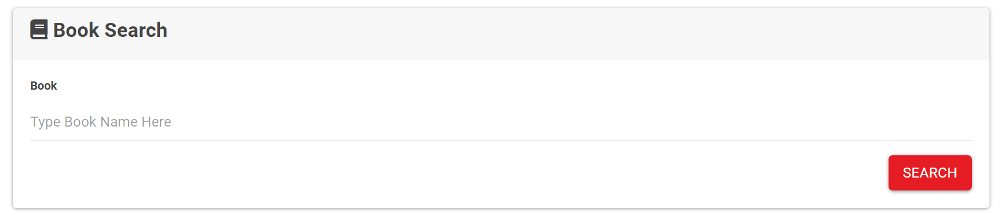
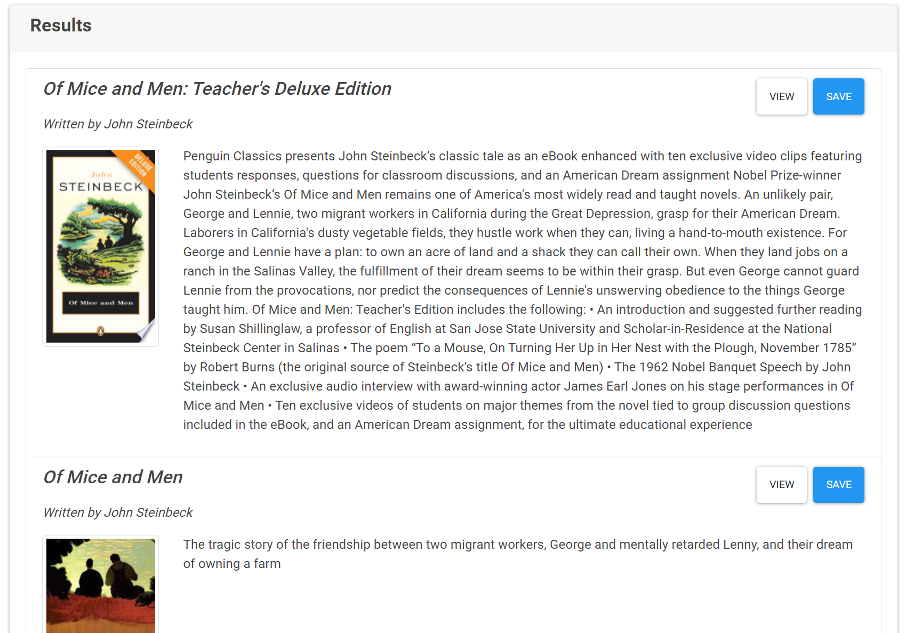

<!-- Google Book Search -->

  <h3 align="center">Book Search</h3>

  

    A web application that allows you to search the google book api, see book details, and save your favorites.
     
    <a href="https://shielded-woodland-40971.herokuapp.com/"><strong>Link to Live Website»</strong></a>
     
  

<!-- TABLE OF CONTENTS -->
## Table of Contents

* [About the Project](#about-the-project)
  * [Built With](#built-with)
* [Visit the Site](#visitTheSite)
* [Usage](#usage)
* [Contributing](#contributing)
* [License](#license)
* [Contact](#contact)

<!-- ABOUT THE PROJECT -->
## About The Project

[Book Search](https://shielded-woodland-40971.herokuapp.com/)

This application allows you to search the Google Book API.  Type in a title of a book and see, relevant results from your search.  This includes, Titles, Author, an image of the book and a description.  If interested, save a book to come back to it later or view for more details.

### Built With
* [JavaScript](https://www.javascript.com/)
* [heroku](https://www.heroku.com/home)
* [Google Book APIs](https://developers.google.com/books)

## Visit The Site

Visit the live website at [Here](https://shielded-woodland-40971.herokuapp.com/)

## Usage

The primary purpose of this project is to search books.

1. Search a Book
    

2. See Relevant results
    

## Contributing

Contributions for this web application was made by 
* [Ryan Durk](https://github.com/rpdurk), 

<!-- LICENSE -->
## License

MIT License
